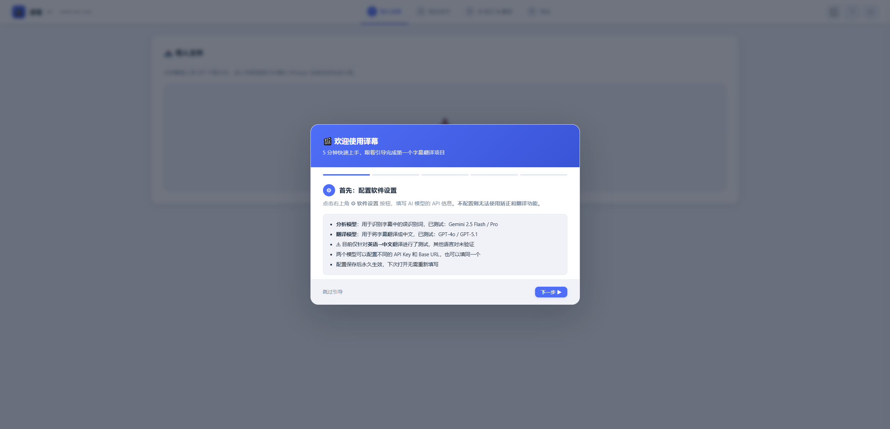
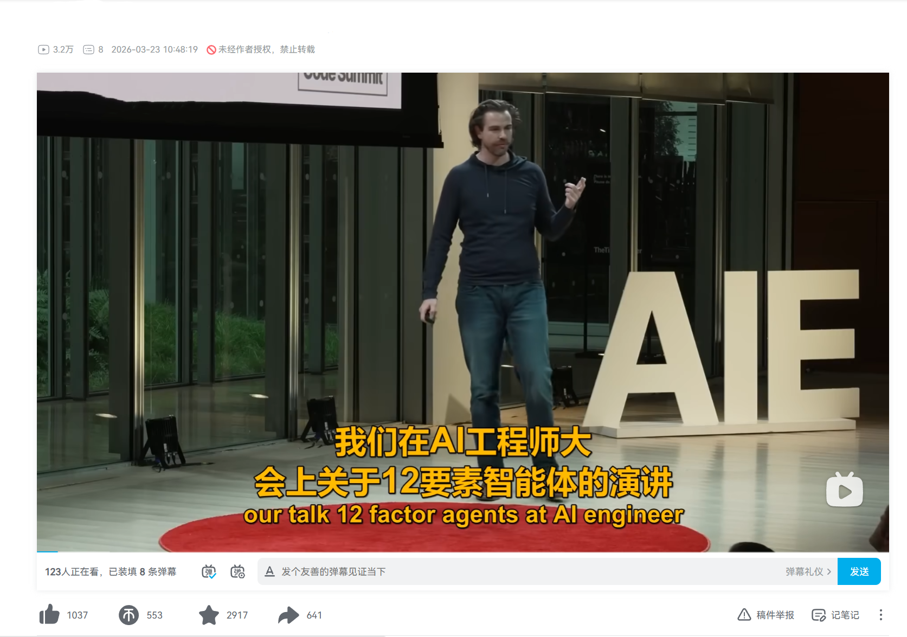
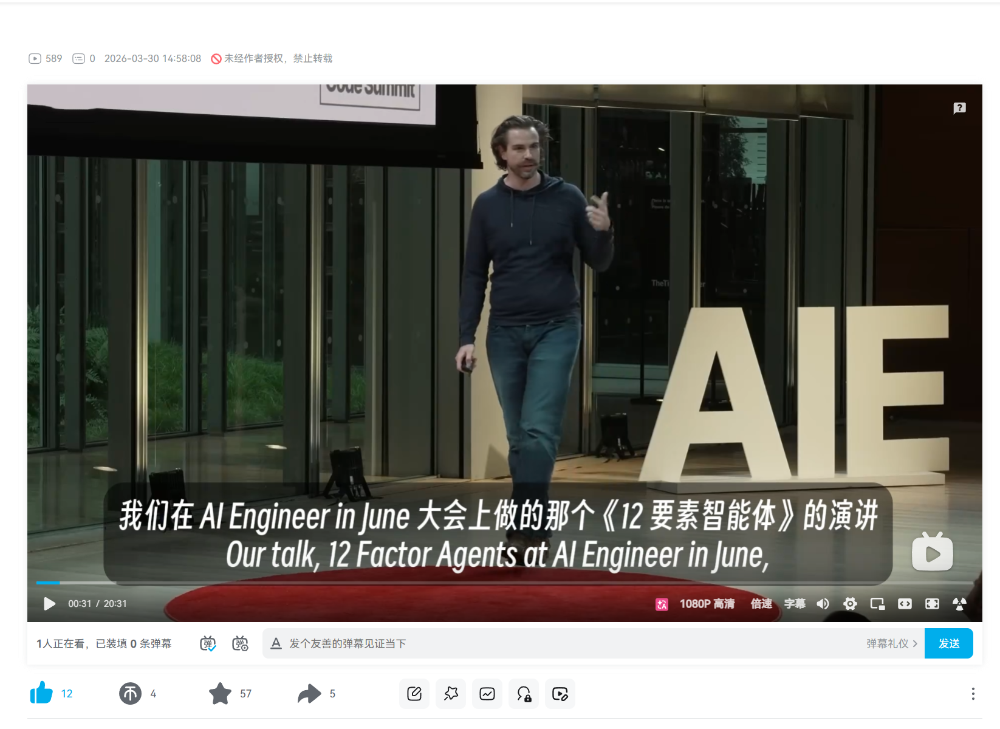

# 译幕 YiMu

**通过多阶段工作流，解决语音转文字错误和大模型幻觉问题，实现专业级 SRT 字幕翻译。**

> 目前仅针对 **英语 → 中文** 翻译进行了完整测试，其他语言对尚未验证，欢迎自行尝试并反馈。

### 什么是 SRT？

SRT 是最通用的字幕文件格式，几乎所有视频软件都支持。译幕的工作流程是：

1. 导入英文 SRT 字幕文件（或上传音视频由本地 Whisper 自动生成）
2. 译幕完成 AI 矫正 + 翻译，导出双语 SRT 文件
3. 将导出的 SRT 导入剪辑软件（Premiere Pro、DaVinci Resolve、剪映等）或播放器（PotPlayer、VLC 等）即可使用



---

## 翻译效果对比

### 视觉对比

同一视频、同一句话，译幕 vs 其他翻译方案：

| 其他方案 | 译幕 |
|:-------:|:----:|
|  |  |
| 我们在AI工程师大会上关于12要素智能体的演讲 | 我们在 AI Engineer in June 大会上做的那个《12 要素智能体》的演讲 |

### 与 VideoLingo 对比测试

使用同一个 17 分钟英文视频、同一个翻译模型，对比译幕与 [VideoLingo](https://github.com/Huanshere/VideoLingo)（16.4k Star）的翻译结果：

**专有名词准确性（ASR 矫正的价值）：**

| 原文 | VideoLingo | 译幕 |
|------|-----------|------|
| Claude Agent SDK | ❌ **Cloud** Agent SDK | ✅ **Claude** 智能体 SDK |
| Sonnet 4.5 | ❌ **Solid** 4.5 | ✅ **Sonnet** 4.5 |
| handing off context | ❌ handing off **contacts** | ✅ 交接**上下文** |

VideoLingo 没有 ASR 矫正环节，语音识别的错误直接被翻译出去。译幕在翻译前先矫正 ASR 错误，专有名词准确率显著更高。

**速度对比（同一台机器、同一视频）：**

| 阶段 | 译幕 | VideoLingo |
|------|------|-----------|
| 纯翻译流程 | **约 3 分钟** | 约 10 分钟 |
| 含转录的全流程 | 约 7.5 分钟 | 约 25+ 分钟 |

译幕采用并行翻译 + 轻量检测修复，速度约为 VideoLingo 的 3 倍。

---

## 解决了什么问题？

现有的 AI 字幕翻译方案普遍存在两个致命问题：

### 问题一：语音转文字的错误会被直接翻译

语音识别（ASR）输出的文本充满错误——专有名词被识别成发音相近的常见词（如 "DeepSeek" → "deep sea"），短句被碎片化切割。如果直接拿这些错误文本去翻译，错误会被放大并固化到译文中，且译后几乎无法溯源修正。

### 问题二：大模型翻译存在幻觉和格式错误

LLM 在翻译字幕时会产生多种问题：

- **重复翻译**：遇到半句话时"自动补全"，导致相邻条目译文重复拼接
- **短句跳过**：过短的字幕条目被模型忽略，直接丢失译文
- **序号错误**：模型输出的序号与原文不对应，导致译文错位到其他条目上
- **时间轴错误**：模型输出的时间轴与原时间轴不对应，字幕显示时机与语音不同步

这些问题在简单的"丢给模型逐句翻译"方案中几乎无法避免。

---

## 译幕的解决方案：多阶段工作流

译幕设计了一套完整的工作流，在翻译前、中、后三个阶段分别处理这些问题：

### 翻译前 — 修正源文本

| 阶段 | 做什么 | 解决什么 |
|------|--------|----------|
| 短句合并 | 将 ASR 产生的碎片字幕按语言规则自动合并 | 消除碎片化切割 |
| AI 语音识别矫正 | AI 分析字幕中的误识别词，用户确认后批量替换 | 在翻译前修正专有名词等 ASR 错误 |
| 内容分析 | AI 取样字幕，识别视频领域，生成专业术语表 | 为翻译提供领域上下文和统一术语 |

### 翻译中 — 保证一致性

| 阶段 | 做什么 | 解决什么 |
|------|--------|----------|
| 术语注入 | 术语表注入每一批翻译的 Prompt | 跨批次术语翻译一致 |
| 并行翻译 | 多批次并发调用翻译 API | 提升速度，同时保持每批上下文 |
| 三级对齐算法 | 序号匹配 → 顺序匹配 → 原文归一化匹配 | 防止模型输出格式偏移导致译文错位 |

### 翻译后 — 检测与修复

| 阶段 | 做什么 | 解决什么 |
|------|--------|----------|
| 去重修复 | 检测相邻条目译文的重复前缀，自动裁剪 | 消除 LLM "自动补全"产生的重复拼接 |
| 质量检测 | 规则检测漏翻（中文字数过少）和异常短句 | 发现翻译遗漏 |
| AI 智能修复 | AI 仅判断合并方向（merge_up/merge_down/skip），软件执行合并后重新调用翻译 API 生成译文 | AI 不生成内容 = 不产生幻觉 |
| 时间间隔拦截 | 间隔 > 500ms 的相邻字幕强制跳过合并 | 防止跨说话人合并 |

**整个流程一键触发，全自动执行，无需手动干预。**

---

## 功能一览

- **SRT 字幕导入** — 直接上传已有的 `.srt` 文件
- **音视频转录** — 上传音视频，由本地 Whisper 自动生成字幕
- **短句合并** — 按语言类型（CJK/Latin）合并碎片字幕
- **AI 语音识别矫正** — 识别并修正 ASR 错误，支持多轮分析
- **一键翻译** — 分析 → 翻译 → 检测 → 修复，全自动流水线
- **双语字幕导出** — 中英上下位置可调换，预览后下载

---

## 快速开始

### 环境要求

- Windows 10/11
- Python 3.9+
- AI 模型的 API Key（支持 OpenAI 兼容接口）

### 安装

```bash
# 克隆项目
git clone https://github.com/mikuleader/YiMu-Subtitle-Translator.git
cd YiMu-Subtitle-Translator

# 创建虚拟环境并安装依赖
python -m venv .venv
.venv\Scripts\activate
pip install -r requirements.txt
```

### 启动

双击 `启动工作台.bat`（推荐，会自动检测环境和依赖），或手动运行：

```bash
python app.py
```

浏览器访问 `http://localhost:9999` 即可使用。

### 配置 AI 模型

首次使用需点击界面右上角 **⚙ 软件设置**，配置两个模型：

| 模型 | 用途 | 已测试通过 |
|------|------|-----------|
| 分析模型 | 字幕纠错分析，需要推理能力强 | Gemini 2.5 Flash / Pro |
| 翻译模型 | 字幕翻译，需要语言表达能力强 | GPT-4o / GPT-5.1 |

两个模型可配置不同的 API Key 和 Base URL，也可以用同一个。其他模型未测试，欢迎尝试并反馈效果。

### 音视频转录（可选）

如果你已经有 SRT 字幕文件，可以跳过这部分，直接导入即可。

如果需要从音视频生成字幕，需额外安装：

1. **[FFmpeg](https://ffmpeg.org/download.html)** — 用于提取音频
2. **Faster-Whisper CLI**（语音识别引擎）— 从 [whisper-standalone-win](https://github.com/Purfview/whisper-standalone-win/releases) 下载，解压后将 `faster-whisper-xxl.exe` 放到项目 `tools/` 目录或系统 PATH 中

启动后界面会自动检测转录引擎是否可用。

---

## 技术架构

- **前端**：原生 HTML/CSS/JS 单页应用，无框架依赖
- **后端**：Flask + Waitress（端口 9999）
- **AI 调用**：OpenAI 兼容接口（`/chat/completions`）
- **转录引擎**：Faster Whisper（CLI 优先，Python 库备选）
- **数据存储**：纯浏览器内存，无数据库，刷新即清空

---

## 路线图

- [ ] 支持更多语言对（日语→中文、韩语→中文等），工作流框架已预留多语言支持，详见 [多语言改造清单](docs/multilang-roadmap.md)
- [ ] 更多翻译模型的测试与适配

当前版本仅针对英语→中文进行了完整测试，但多阶段工作流的设计思路对任何语言对都适用，后续将逐步扩展。欢迎提交 Issue 反馈你需要的语言。

---

## 许可证

[MIT License](LICENSE)
